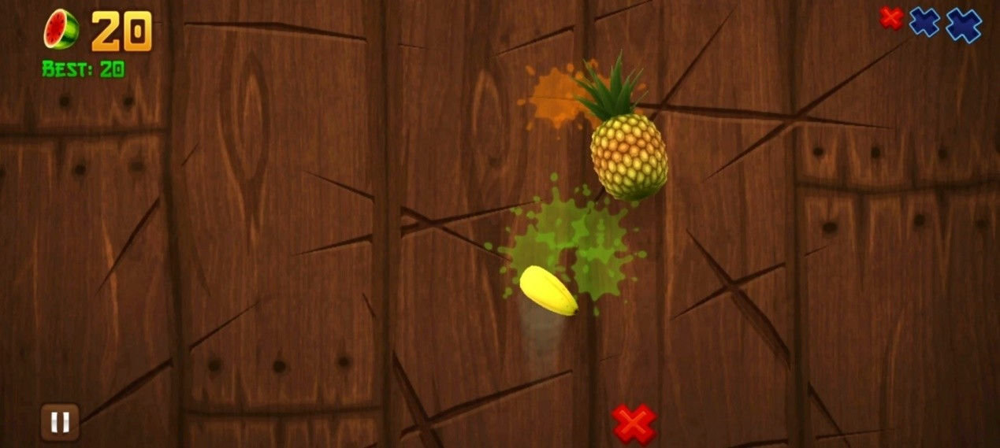
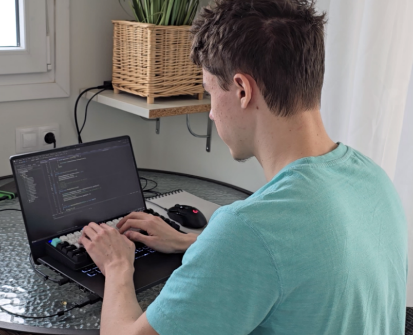
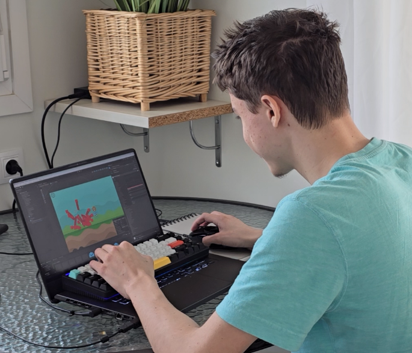
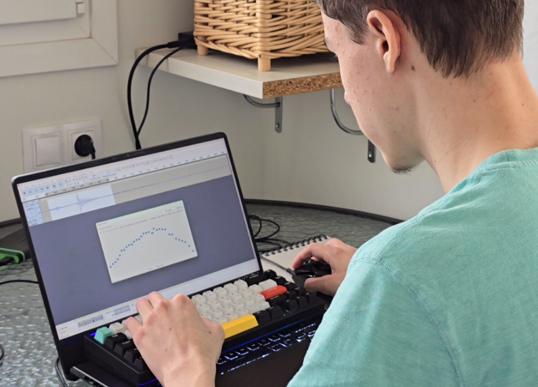
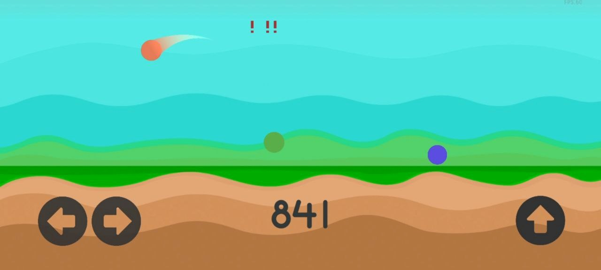
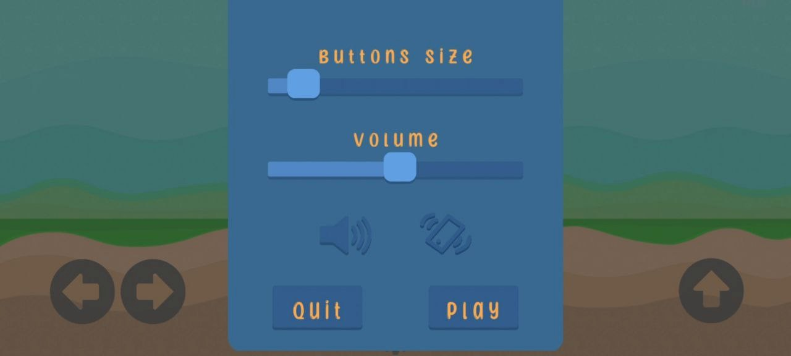
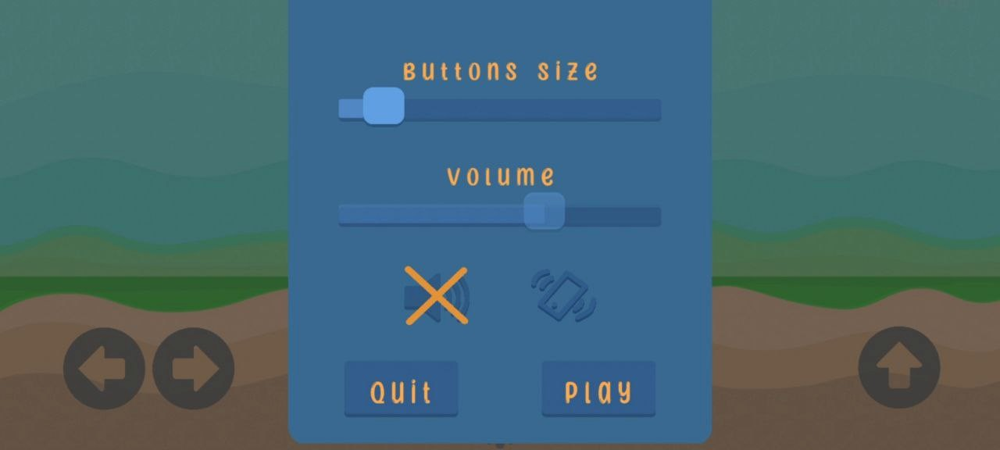
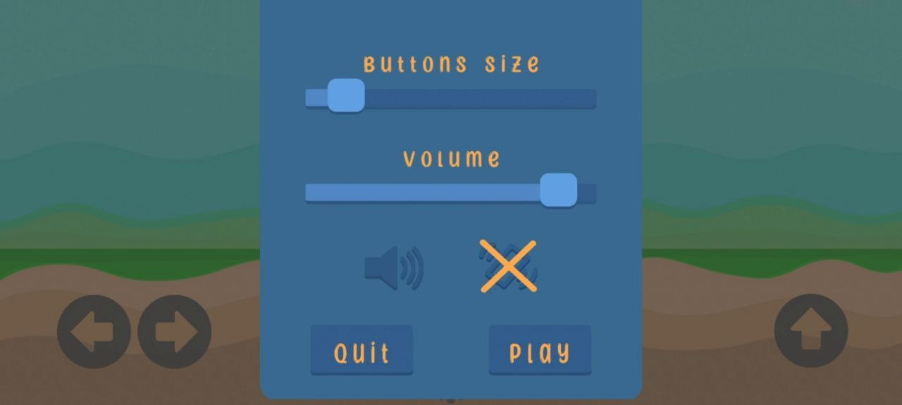
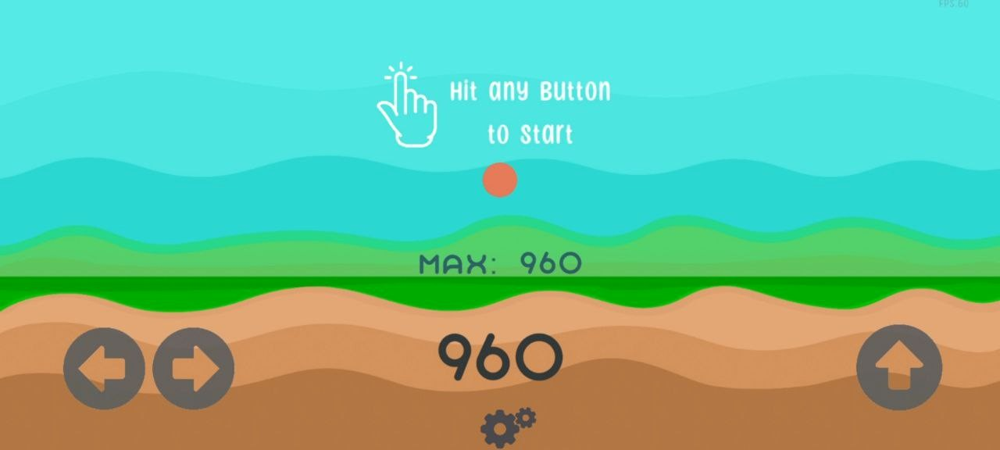
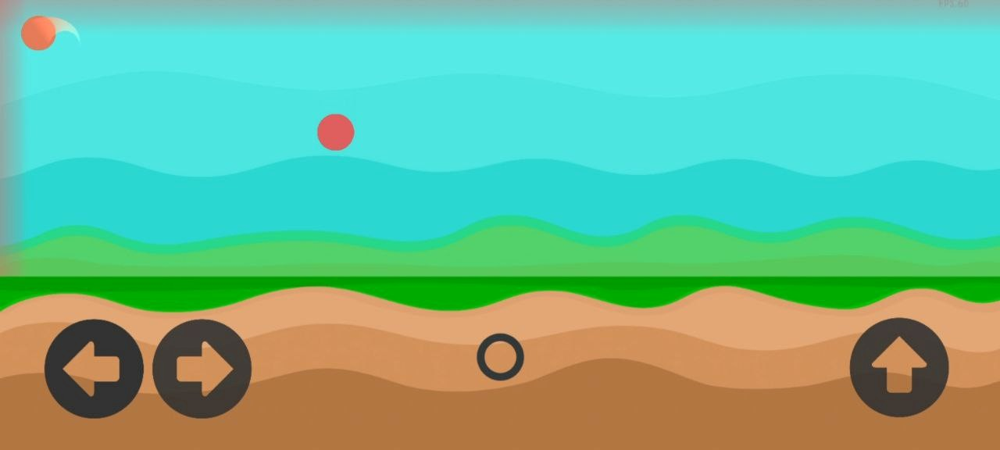

В качестве школьной проектной работы я разработал Lolly Jump - мобильную игру на Unity. Скачать или поиграть в браузере можно на странице [Itch.io](https://ananasikdeveloper.itch.io/lolly-jump)

Исторически это один из моих первых проектов на Unity, начатый 4 ноября 2020 года. В течение нескольких лет я время от времени возвращался к нему и обновлял, что можно подробнее изучить на [GitHub](https://github.com/AnanasikDev/LollyJump) - весь код открытый.

Далее будет текст моей школьной работы.

## **ВВЕДЕНИЕ**

Индустрия компьютерных игр начала активно развиваться с 1980-ых годов1, однако за это время смогла развиться в огромную отрасль с многомиллиардными доходами. Появление компьютерных игр связано с изобретением и распространением компьютеров, а также с созданием различных инструментов для разработки программного обеспечения, в том числе и игр. С развитием техники, технологий разработки, языков программирования и стандартов, разработка компьютерных игр становилась все более доступной, благодаря чему сейчас уже создано и создается огромное количество разнообразных игр. Разработка компьютерных игр стала настолько доступной, что даже школьники с минимальным знанием программирования способны создавать свои простые игры. Стоит отметить, что с точки зрения потребления, компьютерные игры также стали значительно доступнее за последние 20 лет, ведь теперь достаточно иметь какое-либо устройство (ноутбук, персональный компьютер, смартфон, планшет) и цифровую копию игры для того, чтобы играть. А благодаря онлайн-ресурсам получение копий игр возможно даже дома.

За последние 10 лет компьютерные игры стали позиционироваться не только как средство развлечений, но и как инструменты для эффективного обучения и симуляции. Современные игровые методы обучения и воспитания помогают не только детям понимать относительно сложные идеи, но и взрослым с большой эффективностью и удовольствием учить иностранные языки и другие комплексные концепции. Использование игровых технологий даже позволяет обучать специалистов различных областей в виртуальном пространстве, значительно упрощая изучение новых методов работы без рисков для здоровья3.

Несмотря на популяризацию компьютерных игр и обнаружение важной роли компьютерных игр в социальном, экономическом и культурном развитии общества, в России развитие происходит существенно медленнее4, чем в Америке и Европе. Поскольку спрос давно обогнал предложение в индустрии компьютерных игр в России, есть потребность в увеличении темпов развития этой сферы.

Таким образом, развитие технологий в этом направлении является очень перспективным.

Объектом исследования является разработка компьютерных игр.

Предмет исследования - технологии разработки компьютерной казуальной игры.

Цель работы - разработка прототипа компьютерной казуальной игры для мобильных устройств.

Процесс достижения поставленной цели включает в себя следующие задачи:

- Исследование понятия компьютерных игр и их классификации;
- Исследование алгоритма реализации игры;
- Анализ технических средств создания компьютерных игр;
- Исследование уже существующих игр;
- Выбор жанра и платформы игры, определение основных элементов игрового процесса, целей игрока, способов их достижения, препятствий;
- Разработка прототипа игры.

В работе были использованы следующие методы: работа с информацией (книги, статьи, учебники, интернет-ресурсы), а также моделирование (создание игры).  
   

## **Глава 1. Теоретические особенности создания компьютерной игры**

### 1.1 Исследование понятия и классификации компьютерных игр

Термин «компьютерная игра» (или «видеоигра») обозначает компьютерную программу, которая создает условия для протекания игрового процесса («геймплея»). Многие игровые вселенные (выдуманные миры, в которых разворачиваются действия игры) вдохновлены книгами, фильмами, реальными локациями/событиями/личностями и т.д, хотя не редко компьютерные игры выступают как независимый полноценный жанр искусства и развлечений3.

Некоторые игры, получающие, как правило, меньшее распространение, могут выступать в роли основного или вспомогательного учебного материала. Уже известны случаи использования технологий компьютерных игр в образовательных и организационных целях в школах Японии, Финляндии и США, хотя до сих пор такой подход не является достаточно практичным для повсеместного использования. В 2011 году США признали компьютерные игры отдельным видом искусства, наравне со значительно более старыми театром и живописью. Более того, по некоторым компьютерным играм проводятся любительские и профессиональные спортивные соревнования по всему миру - эта дисциплина называется киберспорт и является признанным видом спорта в России с 2016 года5.

Таким образом, компьютерные игры являются важной частью современной жизни в самых разных ее сферах - от искусства до науки и образования. Такое широкое разнообразие видов игр требует классификации, которая может базироваться на разных аспектах игр:

1\.     Жанр;

2\.     Количество игроков;

3\.     Визуальное (графическое) представление;

4\.     Связь сюжета с игровым процессом;

5\.     Связь игрового пространства (мира) с игровым процессом;

6\.     Прочее.

Классификации компьютерных игр6 развивались с развитием индустрии, поэтому более старые охватывают значительно меньший спектр различных особенностей игр. Однако, существуют жанры, наиболее часто выделяемые как основные и наиболее различимые. Виды и особенности жанров представлены в таблице 1.

Таблица 1. Виды и особенности жанров

| **Жанр** | **Особенности** | **Поджанры** |
| --- | --- | --- |
| Аркада (Arcade),  казуальные игры (Casual),  гиперказуальные игры (Hypercasual) | Простой игровой процесс | Платформер,  Скроллер,  Shoot 'em up |
| Приключенческая игра (Adventure) | Сюжет занимает центральную роль в игре | Текстовые приключения,  Визуальная новелла,  Квест |

Продолжение таблицы 1

| Симулятор (Simulator) | Акцент на реалистичности | Авиасимулятор,  Автосимулятор,  Космосимулятор,  Симулятор жизни |
| --- | --- | --- |
| Гоночная игра (Race game) | Необходимо обогнать как можно больше соперников | \-  |
| Экшен (Action) | Интенсивные действия, требуется большая активность игрока | Королевская битва,  Скролл-шутер,  Файтинг,  Стелс-экшен |
| Стратегия (Strategy) | Акцент на аналитических действиях игрока, продумывании стратегии | Экономическая стратегия,  Военная стратегия,  Tower-defence (с англ. «защита башни») |
| Ролевая игра (RPG) | Исполнение определенной роли, погружение в жизнь выдуманного персонажа | Японская ролевая игра,  Рогалик,  Экшен RPG |
| Головоломка (Puzzle) | Решение задач | \-  |

Классификацию компьютерных игр по жанрам нельзя считать полной и всеобъемлющей по ряду причин. Во-первых, игры даже в рамках одного жанра могут значительно отличаться по определенным критериям, не включенных в свойства жанра. Примеры таких критериев:

- Количество игроков;
- Длительность игровой сессии;
- Количество мест игрового действия (локаций, «уровней»);
- Сложность прохождения игры или отдельных уровней.

Во-вторых, некоторые игры сами порождают жанры, потому что сильно выделяются и не могут быть однозначно определены ни в один уже существующий. Например, жанр рогалик (англ. Roguelike - «похожий на Rogue») появился после выхода игры Rogue, ставшая уникальной в своем роде в то время.

Помимо жанровой класс ификации игр, существуют и другие классификации. Одна из них, придуманная Аарсетом, Сметстадом и Суннано в 2003 году6, опирается на более сложную иерархическую структуру, включающую в себя 3 уровня. Первый («группа») представляет собой базовый элемент игры (время, пространство и т.п.), второй («измерение») разбивает этот элемент на несколько свойств этого аспекта, а третий («значение») описывает конкретную реализацию. Так, в первой группе есть элемент «время», у которого есть три измерения: скорость, репрезентация и цель. На уровне «значение» скорость разбивается на «в реальном времени» и «пошаговое»; репрезентация - на «реалистичное» и «выдуманное»; цель - на «конечная, достижимая» и «бесконечная и недостижимая».

Таким образом, можно создать любую структуру для классификации игр, включая в нее разные параметры и аспекты. Основные можно представить следующим образом:

По визуальному представлению:

- текстовые - игрок взаимодействует с игрой через текст, отсутствуют другие типы графической информации;
- 2D (англ. 2-Dimensional - «двухмерные») - весь игровой процесс происходит в плоскости, все графические элементы представляют собой двухмерные, «плоские» изображения;
- 3D - игровой процесс разворачивается в трехмерном пространстве, графические элементы представляют собой 3D-модели.

По количеству игроков:

- Однопользовательские;
- Многопользовательские;
  - Несколько игроков могут играть только находясь рядом / в одной сети WiFi;
  - Несколько игроков могут играть вне зависимости от их взаимного расположения.

По платформе:

- Персональные компьютеры, ноутбуки;
- Мобильные устройства (телефоны, планшеты);
- Игровые консоли/приставки;
- Шлемы/костюмы виртуальной реальности (VR).

По реализации пространства:

- Уровневое (вся игра состоит из небольших независимых локаций с явным переходом между ними - уровней);
- Открытый мир (большое открытое пространство).

Существует множество других свойств игр, по которым их можно группировать, а уже рассмотренные выше могут быть значительно уточнены. Так, можно включить в раздел «графическое представление» менее популярные 2.5D, псевдо-3D, 4D, аудио-игры; в раздел жанры можно включить ритмичные музыкальные игры, спортивные игры, zero-player игры (игры, в которых не требуется участие игрока), хорроры, тамагочи и другие. Я привел самые основные в качестве демонстрации, но данной классификации уже может быть достаточно для описания множества игр.

Из-за стремительного развития молодой игровой индустрии, игры значительно трансформируются, появляются новые жанры, новые реализации уже описанных параметров, из-за чего до сих пор не существует однозначной классификации, покрывающей все компьютерные игры. Другая причина этого заключается в том, что многие игры могут удовлетворять сразу нескольким критериям. Например, одна и та же игра может выйти на разные типы платформ, в нее можно играть как одному, так и с друзьями в одной сети или с игроками со всего мира. Таких игр много, и их нельзя однозначно определить в одну или другую группу по каким-либо признакам, что делает их классификацию более трудной и неоднозначной.

Исходя их предложенной классификации я решил разработать мобильную казуальную игру с 2D графикой. Подобные игры отличаются простым и понятным геймплеем с простой графикой. Их преимущество в простоте разработке, поскольку они не требуют высоких навыков дизайна или программирования и хорошо подходят неопытным разработчикам.

### 1.2 Алгоритм реализации игры

Общий алгоритм реализации компьютерной игры включает в себя три основных этапа: планирование, реализация и поддержка.

На первом этапе необходимо определить особенности игры, такие как жанр, сеттинг (место, время и условия, в которых происходит игровой процесс), основные игровые механики (способы взаимодействия игрока с игрой, графическое представление, целевые платформы, целевая аудитория и другие.

Первый шаг - определение цели и идеи игры. Как правильно идея связана с жанром, поскольку он определяет границы, в рамках которых может дальше развиваться идея. Так, идея ролевых игр, визуальных новелл - позволить игроку прожить жизнь выдуманного персонажа в конкретный период времени при конкретных обстоятельствах, погрузиться в повествование, исследовать мир или найти ответ на какой-то вопрос. В стратегических играх идея часто основывается на создании своей империи/государства/производства и т.п., превосходящего все остальные. Тем не менее, жанры и идеи можно смешивать и изменять для получения уникальных сеттингов или даже создания новых жанров.

Второй шаг - определение целевой аудитории, средней длительности игровой сессии и целевых платформ. Все это частично зависит от жанровых особенностей: экшен игры и стратегии могут не подходить для детей, аркады и пазлы могут оказаться не такими успешными на персональных компьютерах или консолях, а ролевые игры или стратегии редко имеют короткие игровые сессии. Однако это лишь наблюдения, основанные на уже существующих играх, а не жесткие ограничения. От выбора целевой аудитории зависит графическое представление, сложность геймплея, глубина сюжета и т.д. Выбор целевой платформы во многом определяет визуальное представление (реалистичная 3D графика плохо подходит для маломощных мобильных устройств), геймплей (джойстик в геймпадах консолей или акселерометр, встроенный в мобильные устройства, открывают возможность создания уникальных для этих платформ геймплейных механик) и т.д. Длительность игровой сессии и обстоятельства, при которых в эту игру будут чаще всего играть, определяют глубину сюжетного повествования, визуальное представление и сложность геймплея. Так, в казуальные игры удобно играть, например, стоя в очереди или во время поездки в метро, а в ролевые игры с опорой на сюжет проще погрузиться, играя, к примеру, дома.

Третий шаг - определение средств реализации игры, такие как язык программирования, игровой движок (инструмент для упрощения процесса реализации игр), среда разработки (приложение для написания программного кода). Популярным среди разработчиков казуальных игр игровым движком является Unity, использующий язык программирования C## в качестве основного скриптового языка. Unity, в отличие от некоторых других движков, является бесплатным, пока ежегодный доход не превышает \$100000, что делает его, фактически, бесплатным для небольших студий или одиночных разработчиков. И Unity, и C## являются достаточно доступными для освоения даже начинающими программистами, позволяя создавать простые игры с минимальным опытом разработки игр и программирования, что является еще одной причиной их популярности. Для разработки своей игры я также выбрал Unity и C#, поскольку уже имею опыт с этими инструментами и считаю их удобными и подходящими для реализации выбранной игры.

Следующий этап - реализация. Это самый продолжительный и трудоемкий этап разработки проекта, включающий множество шагов.

Первый - создание «скелета» игры. Необходимо сразу создать удобный и расширяемый каркас будущей игры, чтобы потом его дополнять необходимыми элементами. На этом шаге важно создавать максимально универсальную систему, которую затем не придется редактировать. Например, если на этом шаге проектировать игру в самом простом виде, может так получиться, что, при необходимости внесения небольшого изменения в игру (например количества противников или частоты их появления), потребуется вносить значительные правки в код, что усложняет разработку и ограничивает возможности дальнейшего развития проекта. То же касается и сюжета, если он есть: сначала необходимо продумать основные, самые значимые события, взаимоотношения между персонажами и т.д., чтобы потом «нанизывать» на эту структуру детали. Это очень ответственный шаг, на котором формируются очертания будущей игры.

Второй шаг - это непосредственно программирование и прототипирование большей части игровых механик, взаимодействия игрока с игрой. Здесь создается интерфейс, программируются основные и второстепенные игровые механики, учитываются все вариации действий игрока и т.д. Сюжет пополняется второстепенными событиями и персонажами, добавляются элементы. На этом шаге создается большая часть графики для игры.

Третий шаг - исправление ошибок, добавление мелких деталей, корректирование интенсивности игрового процесса и т.д. Исправление ошибок необходимо делать по мере их появления, однако не все удается обнаружить сразу и не на все можно выделить время в процессе реализации важных элементов игры. Существуют разные типы ошибок, которые по-разному влияют на игровой процесс и, в соответствие с этим, они имеют разный приоритет исправления. Так, ошибки, вызывающие сбои работы программы могут сделать игру неработоспособной из-за невозможности запустить ее, неожиданного закрытия приложения или проблем с производительностью. Это самые серьезные ошибки, которые не должны войти в финальную версию, однако их может быть трудно отследить, особенно при производстве игры на множество различных платформ и устройств. Часто бывает, что, во время тестирования на одном устройстве (например, на мобильном телефоне с операционной системой Android) игра работает стабильно, а при запуске той же игры на другом устройстве (с другой или устаревшей операционной системой) могут возникать проблемы. Небольшие ошибки, такие как графические глюки, имеют более низкий приоритет исправления, поскольку они слабее влияют на общее впечатление игрока.

На этом же шаге дорабатываются эффекты, звуки, анимации, добавляются незначительные графические, звуковые и геймплейные элементы. Здесь может быть принято решение об удалении каких-то элементов, если, по мнению разработчиков, они мешают игровому процессу, отвлекают игрока или выглядят не так, как они ожидали изначально. Кроме того, на этом шаге часто происходит финальная доработка геймплея: корректировка сложности, управления и т.п.

Финальный этап включает в себя релиз (выпуск) игры и ее последующая поддержка. Разработчики продолжают исправлять ошибки, добавлять новый контент в игру в качестве обновлений или скачиваемого дополнительного контента (DLC - downloadable content). Это позволяет увеличить популярность игры и, как следствие, доход.

Весь этот процесс от придумывания идеи до поддержки финального продукта называют пайплайном (англ. Pipeline - трубопровод). Пайплайн можно описать другим способом, более понятным в индустрии: сначала собирается альфа-версия игры, в которой работают основные механики, но графика значительно упрощена или даже собрана из примитивов (простых геометрических фигур). Затем проводится альфа-тестирование, где проверяются эти механики, и, если никаких проблем не обнаружено, начинается разработка бета-версии. Бета-версия отличается более проработанной графикой, исправленными ошибками, новыми второстепенными механиками и т.д. Затем проходит бета-тестирование, на котором проверяется не только работоспособность основных механик и ощущения от игры, но и визуальная, звуковая и сюжетная составляющие. По прохождении бета-тестирования проводится финальная доработка продукта, исправление мелких ошибок, и идет подготовка к релизу. Далее происходит работа с издательствами, прессой, производится релиз и начинается поддержка игры.

В целом, процесс разработки компьютерных игр схож с процессом разработки программного обеспечения в целом. Сначала создается основной каркас программы, проверяется общая работоспособность и удобство, затем производится основной и второстепенный контент, разрабатывается графика, снова проверяется работоспособность, удобство и приятность использования, после чего программа дорабатывается и выпускается. Примерно так же выглядит процесс создания не только программного обеспечения, но и почти любой работы: от строительства до живописи.

##

### 1.3 Технические средства создания компьютерных игр

#### 1.3.1 Исследование и анализ игровых движков

Игровой движок7 - это программное обеспечение, предоставляющее множество инструментов для создания компьютерных игр. Игровой движок позволяет разработчикам собирать все ассеты (элементы, из которых состоит игра - код, графика, звуки, музыка, эффекты, анимации), созданные в специализированных программах, вместе. Игровой движок является очень удобным и важным инструментом разработки игр, поскольку значительно упрощает большинство задач, а некоторые и вовсе упраздняет. Благодаря этому создание игр является очень творческим процессом, ведь, как правило, не нужно вдаваться в технические подробности работы отдельных частей движка, что также существенно ускоряет работу над проектами.

Тем не менее, игровой движок не является незаменимым инструментом с технической точки зрения, поскольку весь необходимый функционал можно разработать самому. Более того, такой подход используется многими разработчиками и студиями по разным причинам. Во-первых, таким образом можно получить много полезного опыта работы с графикой, физикой, оптимизацией и многим другим. Так, создав однажды собственную систему рендера (визуализации) освещения, теней, отражений, преломлений, бликов, можно пользоваться уже существующими движками с более глубоким пониманием технической работы различных механизмов целой системы. Вторая причина, по которой некоторые разработчики отказываются от использования игровых движков - это их громоздкость и чрезмерная универсальность. Даже пустой проект, созданный в современных игровых движках, может весить несколько десятков мегабайт, что, конечно, не так много, однако с добавлением функционала в игру размер проекта может непропорционально расти, из-за чего небольшие мобильные игры могут занимать сотни мегабайт на диске. К тому же, разработка определенных игр может быть ограничена возможностями конкретных игровых движков, поскольку они нацелены на универсальность в рамках современной индустрии, тогда как проекты с революционной графикой (например 4D) или физикой (например, в неэвклидовом пространстве или с собственными законами) не могут быть реализованы их средствами.

Однако, поскольку разработка собственного игрового движка является очень сложным и трудоемким процессом, большинство разработчиков предпочитают пользоваться существующими средствами. В данном разделе рассмотрены некоторые самые известные и популярные игровые движки: Unreal Engine, Game Maker Studio, Godot и Unity. На сегодняшний день их существует гораздо больше, однако в рамках моей работы достаточно рассмотреть наиболее распространенные.

**1\. Unreal Engine**

Unreal Engine - это мощный игровой движок, разработанный компанией Epic Games. Он был выпущен в 1998 году, став одним из первых больших универсальных платформ для разработки игр. С тех пор он стал одним из ведущих игровых движков в индустрии, который на данный момент применяется не только в создании множества высококлассных трехмерных игр с гиперреалистичной графикой, но и в кинематографе, благодаря реалистичным визуальным эффектам и передовым технологиям.

Unreal Engine написан на языке C++ и использует этот язык в качестве скриптового языка для разработки кода игр. Движок специально оптимизирован для создания высококачественных 3D игр, хотя подходит и для 2D игр для разных платформ. Unreal Engine также предлагает широкий набор инструментов для создания игр различных жанров, включая шутеры от первого лица, RPG и экшен-приключения, несмотря на то что изначально был создан для разработки игр в жанре шутер (экшен).

Unreal Engine предлагает бесплатную версию, но при успешной монетизации проекта предусмотрен процент с дохода. Это делает его доступным для начинающих разработчиков, но при этом стимулирует их к созданию высококачественных и успешных проектов.

Благодаря большой команде разработчиков и открытому исходному коду проекта, движок развивается очень быстро, чем привлекает много разработчиков. Когда он только появился, он был уникальным в своем роде, включая в свой функционал революционные для своего времени технологии, что продолжается и до сих пор.

**2\. Game Maker Studio**

Game Maker Studio - это простой в использовании игровой движок, который позволяет создавать 2D игры без необходимости в программировании. Он был выпущен компанией YoYo Games в 1999 году и с тех пор стал популярным среди начинающих разработчиков благодаря своей доступности и простоте.

Бесплатная версия Game Maker Studio предоставляет ограниченный функционал. Это делает его доступным для новичков и позволяет им начать создавать несложные игры без необходимости в крупных инвестициях.

**3\. Godot**

Godot - это бесплатный игровой движок с открытым исходным кодом, разработанный сообществом разработчиков. Он был выпущен в 2014 году и с тех пор набирает популярность благодаря своей простоте использования и мощным функциональным возможностям.

Godot написан на языках C++ и C и предлагает поддержку как 2D, так и 3D графики. Он обладает широким спектром функций, включая анимации, физику, звук и многое другое. Godot также имеет интуитивно понятный интерфейс, что делает его привлекательным выбором для начинающих разработчиков.

Одним из основных преимуществ Godot является его бесплатность и открытость исходного кода. Это позволяет разработчикам создавать игры без необходимости платить за лицензию и иметь доступ к исходному коду для настройки и расширения функциональности движка. Последние годы Godot очень стремительно развивается, что является дополнительной причиной его популярности среди разработчиков.

**4\. Unity**

Unity - это один из наиболее широко используемых игровых движков в индустрии. Он был выпущен в 2005 году Unity Technologies и с тех пор стал одним из ведущих инструментов для разработки игр. Unity написан на языках C++ и C## и поддерживает множество различных платформ, включая мобильные устройства, ПК, консоли и костюмы виртуальной реальности8.

Unity популярен благодаря простому в освоении интерфейсу и используемому языку программирования, что делает его достаточно доступным для освоения новичками. Несмотря на это, он является очень мощным и универсальным инструментом, поддерживающим множество современных технологий, включая глобальное освещение в реальном времени, шейдеры, скелетные анимации, физику, и многое другое.

Пока ежегодный доход игры не превышает \$100000, разработчики могут пользоваться Unity бесплатно и с минимальными ограничениями. Это делает движок доступным для широкого круга пользователей и позволяет новичкам начать создавать игры без больших инвестиций.

Исходя из проведенного анализа некоторых самых популярных игровых движков, я принял решение об использовании для реализации своей игры Unity, поскольку считаю его наиболее подходящим для реализации простых 2D игр. Более того, в работе с Unity, в отличие от других движков, я уже имею некоторый опыт, что позволит мне сделать финальный продукт более качественным, чем если бы я изучал новую технологию с нуля.

#### 1.3.2 Исследование и анализ графических редакторов

Графический редактор9 - это программное обеспечение, созданное специально для просматривания, редактирования, обработки и создания двухмерных цифровых изображений. Графические редакторы могут быть общего назначения, позволяющие выполнять широкий спектр действий над изображениями, а могут быть специализированные, предназначенные для конкретных задач и предоставляющие соответствующие функции.

В этом разделе будут рассмотрены несколько графических редакторов: GIMP, Krita и Paint.NET.

**1\. GIMP**

GIMP (GNU Image Manipulation Program) - это бесплатный и открытый графический редактор, разработанный сообществом проекта GIMP. Он предоставляет широкий спектр возможностей для редактирования и обработки изображений, включая ретуширование, коррекцию цвета, создание изображений с нуля и многое другое. GIMP поддерживает множество форматов файлов, включая JPEG, PNG, GIF, TIFF и многие другие.

Приложение бесплатное и поддерживается на различных платформах, включая Windows, macOS и Linux. Это делает его доступным для широкого круга пользователей, в том числе для студентов и одиночных разработчиков.

Широкий и универсальный функционал GIMP делает его подходящим для различных целей, включая обработку фотографий, создание иллюстраций, концепт-артов, дизайн веб-страниц, разработку графики для компьютерных игр и многое другое.

**2\. Krita**

Krita - это бесплатный и открытый графический редактор, разработанный Krita Foundation. Он предназначен в основном для рисования и создания цифровых картин, но также имеет достаточный функционал для редактирования изображений и создания ассетов для игр и анимаций. Krita предоставляет широкий набор инструментов для рисования, включая кисти, маркеры и многие другие. Как и большинство графических редакторов, он поддерживает различные типы файлов, включая PSD, JPEG, PNG и другие.

Приложение доступно для установки на Windows, macOS и Linux, что делает его доступным для большинства пользователей. Оно может быть использовано как начинающими, так и опытными художниками и дизайнерами благодаря своей интуитивной пользовательской системе. Krita подходит в первую очередь для художников и иллюстраторов, которые ищут бесплатный и мощный инструмент для цифрового рисования и создания графических работ.

**3\. Paint.NET**

Paint.NET - это бесплатный графический редактор для Windows, разработанный компанией Microsoft и сообществом разработчиков. Его простой и удобный интерфейс является одной из причин его популярности среди начинающих пользователей.

Хотя Paint.NET не имеет такого широкого функционала, как GIMP и Krita, он все равно предоставляет базовые инструменты для редактирования изображений, достаточные для определенных задач, включая разработку базового графического наполнения для компьютерных игр, особенно на этапе разработки альфа-версии.

Paint.NET разработан специально для пользователей Windows и доступен для скачивания из магазина приложений Microsoft Store. Это делает его удобным выбором для тех, кто ищет простой и легкий в использовании графический редактор на этой платформе.

Таким образом, приложение подходит для простых задач по обработке и созданию изображений, но имеет ряд недостатков, среди который доступность только на операционной системе Windows, ограниченный функционал и закрытый исходный код. Однако, благодаря простому интерфейсу и большому сообществу, он является достаточно популярным выбором, особенно среди начинающих разработчиков игр или сайтов.

#### 1.3.3 Исследование и анализ сред разработки

Среда разработки10 (IDE - integrated development environment) - это программа или совокупность программ, позволяющих просматривать, редактировать, создавать и запускать программный код. Среды разработки являются крайне важными инструментами программирования, поскольку совмещают в себе сразу множество функций, такие как анализ кода, предупреждение об ошибках, подсказки, компиляция (подготовка к запуску) кода, отладка, запуск и множество других функций.

Так же, как и игровые движки и графические редакторы, среды разработки можно не использовать, не теряя качество итогового продукта. Компилировать и запускать код можно из командной строки, а редактировать код можно даже в блокноте. Тем не менее, большинство разработчиков предпочитают пользоваться средами разработки, потому что это значительно ускоряет разработку любого программного обеспечения и позволяет программистам сосредоточиться на более важных проблемах.

В данном параграфе будут рассмотрены следующие среды разработки: Visual Studio, Visual Studio Code и Rider.

**1\. Visual Studio11**

Выпущенная компанией Microsoft в 1997 году, Visual Studio стала первой попыткой компании сделать универсальную среду разработки для разных языков программирования. Первая версия поддерживала Visual C++, Visual J++, Visual InterDev и MSDN.

На данный момент Visual Studio является одной из самых популярных сред разработки, которую чаще всего используют для создания больших проектов - начиная от приложений для Windows и заканчивая требовательными компьютерными играми для приставок. Благодаря широкому функционалу, поддержке большого количества языков программирования, технологий и независимых приложений, а также постоянной поддержке разработчиков и сообщества, Visual Studio является универсальным и стабильным выбором.

**2\. Visual Studio Code12**

Visual Studio Code - это еще один продукт от Microsoft, позиционируемый скорее как простой, но мощный редактор текстовых файлов. Программа известна своей расширяемостью и универсальностью: благодаря постоянной поддержке сообщества, библиотека расширений для VS Code постоянно пополняется.

Расширения - это небольшие программы или скрипты, расширяющие и дополняющие функционал какого-либо приложения. Так, изначально минималистичная и простая программа, благодаря расширениям, может иметь достаточно широкий функционал.

Фокус на расширяемости во многом отличает Visual Studio и Visual Studio Code: первая является полноценной IDE с огромным количеством возможностей, тогда как вторая по умолчанию предоставляет лишь базовые возможности работы с текстом с большими возможностями к расширению.

Visual Studio Code часто применяется в образовательных целях, при решении задач, написании небольших скриптов, создании расширений и для многих других задач, однако не так хорошо подходит для разработки больших проектов.

**3\. Rider13**

Rider является продуктом чешской компании JetBrains, выпущенный в 2017 году14. Rider является не такой универсальной средой разработки, по сравнению с двумя другими, упомянутыми выше, однако тоже пользуется большой популярностью среди разработчиков .NET приложений и разработчиков игр в Unity15.

Одним из ключевых недостатков этой среды разработки, выделяющей ее на фоне других, является ее жесткая финансовая стратегия. JetBrains не предлагает бесплатной версии приложения, как это делает Microsoft для своих продуктов, что сильно сокращает количество желающих им пользоваться.

Исходя из приведенного анализа популярных сред разработки, я принял решение использовать Visual Studio в качестве основного инструмента написания программного кода игры. Visual Studio хорошо подходит для создания относительно крупных проектов, таких как компьютерная игра (поскольку необходимо работать с большими объемами кода), а также является бесплатным и уже знакомым мне инструментом.

### 1.4 Анализ существующих разработок

Придуманная мной идея для мобильной игры наиболее точно описывается жанром казуальных игр, поэтому было принято решение проанализировать существующие игры этого жанра. Однако, данный жанр не имеет четкого определения, из-за чего он охватывает достаточно широкий спектр компьютерных игр. Поэтому главной целью анализа является в первую очередь исследование подхода к созданию мобильных игр: как выстраивается затягивающий геймплей из одной или нескольких элементарных механик, как сочетаются между собой простые графические элементы для создания удовлетворительной картинки. В целом, важно получить представление о том, как выглядят существующие мобильные казуальные игры, созданные более опытными разработчиками, чтобы перенять некоторые техники увлечения и удовлетворения игрока.

В качестве объектов исследования я выбрал следующие игры:

- Fruit Ninja;
- Pac-man;
- Frogger;
- Flappy bird.

**1\. Fruit Ninja**16 была разработана австралийской компанией Halfbrick в 2010 году и к настоящему моменту была скачана более миллиарда раз1718 и является одной из самых известных и популярных мобильных игр в мире. Игра продемонстрирована на рисунке 1.

Весь геймплей игры завязан на одной простой механике: необходимо пальцем проводить по экрану так, чтобы разрезать как можно больше фруктов, но не задевать бомбы. При этом пропускать фрукты тоже не следует, поскольку после трех пропущенных фруктов игра заканчивается. В правом верхнем углу экрана находится индикатор пропусков (см. рисунок 2), который позволяет игроку понять, сколько еще ошибок он в праве допустить до поражения.

Одной из ключевых причин, почему эта игра такая затягивающая - это большое количество визуальной обратной связи. За каждое правильное действие игрока (попадание по фрукту) игрок незамедлительно получает удовольствие от ярких эффектов на экране: разрезание фрукта, брызги сока (которые дополнительно остаются на стене сзади на некоторое время), разделение половинок фрукта, след от лезвия. Более того, некоторые ошибки прощаются игрой (можно два раза не попасть по фрукту), но даже когда игра заканчивается, игрок получает похвалу о хорошей игре, приятную визуальную поддержку, и ему сразу предлагается попробовать снова. Все это мотивирует игрока продолжать играть.

**2\. Pac-Man**19 - это аркадная игра, созданная японской студией Namco в 1980 году. Игрок управляет пакманом - желтым персонажем (см. рисунок 3), и его задача съесть все желтые точки в лабиринте, охраняемом привидениями, которых нужно избегать. Каждый призрак имеет собственное поведение. В лабиринте находится четыре особые съедобные точки, которые временно делают призраков уязвимыми, и игрок может их съесть, тогда они вернуться в центральную комнату и через некоторое время снова начнут перемещаться по лабиринту и искать игрока. Pac-Man был придуман после стремительно набиравшей популярность аркадной игры Space Invaders, и потому Тору Иватани - геймдизайнер Pac-Man - основывал некоторые свои решения на опыте Space Invaders. Так, нападения призраки совершали волнами, что давало игроку время расслабиться и морально подготовиться к следующей атаке.

Иватани знал, что, как и с опытом других игр, после выхода Space Invaders появится большое количество других подобных «стрелялок» и что мода на подобные игры через некоторое время закончится. Так он решил разработать другую игру, без насилия и конфликтов, чтобы игра понравилась как мужской, так и женской аудитории. Это повлияло на выбор цветовой палитры и геймплей.

Игра стала невероятно успешной и вошла в список самых значимых компьютерных игр20 и принесла разработчикам почти 13 млрд долларов21, благодаря простой и узнаваемой графике, захватывающим и новым для того времени геймплее с регулярной сменой интенсивности игрового процесса.

**3\. Frogger**2223 - видеоигра в жанре аркада-головоломка, разработанная японской компанией Konami и выпущенная для аркадных автоматов в 1981 году в Японии и Европе. Цель игры - управляя лягушкой, пересечь игровое поле, разделенное на горизонтальные полоски (см. рисунок 4). Безопасные полоски, где лягушке ничего не угрожает, и игрок может передохнуть, чередуются с полосками, где нужно избегать движущихся объектов. Так, за стартовой безопасной полосой идет 5 полос дороги, где нужно уклоняться от автомобилей, затем снова безопасная зона, за которой следует 5 полос реки, где нужно прыгать по бревнам и черепахам. Сложность в том, что нужно безопасно перебежать дорогу, где машины двигаются с разной скоростью, в разном направлении и на разном расстоянии друг от друга; нужно правильно рассчитывать свои прыжки, чтобы не оказаться на черепахе в момент, когда она опускается под воду, не быть унесенным течением за границы игрового поля, и не упасть в воду из-за неудачного прыжка.

При этом за каждую пройденную полосу игроку начисляется 10 очков, а за каждую неиспользованную половину секунды еще по 10 очков (внизу экрана идет отсчет времени). Кроме того, в ячейках, в которые нужно попасть, может появиться муха, за съедение которой начисляется еще 200 очков. Уровень считается пройденным, когда игрок заполнил все 5 ячеек лягушками. Он получает 1000 очков и запускается следующий уровень.

С каждым уровнем игра усложняется. Так, на втором уровне появляются крокодилы, которые могут появиться в ячейке, и тогда в нее нельзя будет безопасно прыгнуть, и змеи, которые ползают по бревнам и могут съесть лягушку. Кроме того, с каждым уровнем машины на дороге и бревна в реке ускоряются (неравномерно, из-за чего некоторые движутся очень быстро, а другие - очень медленно).

Еще одной важной особенностью игры, присущей многим другим играм того времени, было очень простое управление и простая механика. Всегда понятно, к чему приведет каждое действие, из-за чего, каждый раз, когда игроки проигрывали, они не винили игру, а признавали свое поражение, что заставляло их пробовать снова.

Все это сделало простой концепт очень насыщенным и веселым, что стало причиной успеха игры24. Кроме того, благодаря ненасильственной идее, игра стала популярной не только среди мужчин, но и среди женщин и детей. Это же, однако, и вызывало опасения издателей, которые отказывались выпускать игру, так как ожидали, что мужской части аудитории она не понравится и компания бы потеряла много денег.

Сейчас существует множество версий легендарной игры, в которые можно поиграть не на аркадном автомате, а на персональном компьютере или ноутбуке. Помимо адаптированной оригинальной версии игры25 в интернете доступны и совершенно новые реализации той же идеи, такие как Crossy road262728.

**4\. Flappy bird29**. Когда игра вышла в 2013 году, она не была принята аудиторией, однако в 2014 году внезапно стала хитом. Уже к концу января 2014 года игра стала самой скачиваемой на мобильных платформах. В этот период игра приносила своему разработчику ежедневный доход в размере \$50000.

Секрет успеха Flappy Bird во многом основан на простоте игры, причем как геймплейной составляющей, так и графической. Все действия игрока сводятся к простому нажатию по экрану, но как раз в этом и заключается ключевая идея: игрок видит, что игра не сложная, ведь не надо запоминать много правил, учить расположение врагов или их поведение, как это бывает в играх других жанров; достаточно вовремя нажимать на экран. И когда у новичков не получается пройти даже две колонны, они начинают злиться (не на нечестность игры, а на свою неумелость - это важно) и пытаются снова и снова, чтобы доказать себе и другим, что они могут хорошо играть. В этом заключается другой эффект, вызвавший такую популярность Flappy Bird - социальный. Люди склонны делиться своими достижениями с другими, а в такой игре это сделать очень просто - достаточно сказать одно число или показать окошко с рекордом, чтобы заставить другого человека пытаться побить этот рекорд вновь и вновь32.

Конечно, простота не гарантируют успех, но при сопутствующих условиях (необычность, приятная графика, сложный геймплей с простыми механиками, объективная оценка результатов действий игрока) может увеличить шансы на него.

Приведенные выше четыре игры наглядно показывают, как простые игры могут обрести невероятную популярность, стать мировой сенсацией и принести разработчикам колоссальную прибыль. Это, однако, не означает, что более масштабные игры с проработанным сюжетом, сложными механиками и большими локациями не могут стать популярными. Для своей работы я рассмотрел лишь аркадные и казуальные игры, априори имеющие простой и понятный геймплей.

## **Глава 2. Практические особенности создания компьютерной игры**

### 2.1 Определение основных особенностей игры

Для своего проекта я выбрал жанр казуальных игр, поскольку считаю его наиболее удачным для небольших проектов, цель которых - практика программирования или получение опыта разработки. Причина этого в том, что отличительная черта казуальных игр - простота, причем как техническая, так и геймплейная. Это означает, что игру не только не сложно разработать и поддерживать, но и сам процесс игры не вызывает когнитивных трудностей, то есть он понятен.

Конечно, в разработке казуальных игр есть другая сложность - геймдизайнерская. Геймдизайн (англ. «game design» - дизайн игр) - это очень трудный творческий процесс, который формирует основу игры. В процессе геймдизайна придумывается основной концепт игры, ее ключевые механики, то есть что игрок будет делать, почему и зачем, и какие у него альтернативы. Именно геймдизайн определяет теоретически достижимый порог интересности и популярности игры. При плохом геймдизайне (то есть, когда у игрока нет мотивации что-то делать, он не видит цель, долго не может освоить основные механики, он чувствует скуку или ему слишком сложно) даже игра с отличной графикой и звуками не сможет стать интересной и популярной (есть игры, которые больше сосредоточены на эстетике, но они относятся к другим жанрам. В контексте казуальных игр это почти невозможно). При этом игры с проработанным геймдизайном (например, своевременное усложнение и упрощение геймплея, удержание игрока в постоянном интересе, умеренное и актуальное вознаграждение, четкие цели и т.п.) могут стать мировой сенсацией даже с простой графикой, как например было с Flappy Bird.

Хотя геймдизайн является неотъемлемой частью разработки любой компьютерной (и не только) игры, в рамках учебного проекта я собираюсь сделать больший акцент на реализации, программировании и прототипировании, а не на интересе и успехе игры.

Геймплей выглядит следующим образом: игрок управляет оранжевым шариком, он может прыгать и перемещаться по горизонтали. Сверху игрового поля периодически появляются другие шарики, которые игрок не должен задевать, чтобы не проиграть. Когда шарики касаются друг друга или пола, они разделяются на несколько поменьше, которые определенным образом отскакивают. Задача игрока заключается в том, чтобы продержаться в игре как можно дольше, не ударяясь о пол, потолок, стены и не касаясь других шариков.

Поскольку это казуальная игра, я попытался сделать как можно более простое управление, чтобы его не требовалось долго понимать, но нужно было много усилий, чтобы научиться управлять шариком. В некоторой степени это похоже на Flappy Bird, где очень простое и понятное управление, но сложность в том, чтобы научиться его правильно использовать. Графический дизайн я решил сделать в относительно современном стиле, не опираясь на игры до 2000-ых годов, поскольку посчитал, что такой игре больше подойдет оформление в «спокойных» тонах без чрезмерных усложнений.

### 2.2 Методы работы

В работе были использованы следующие методы:

- Работа с информацией (книги, статьи, журналы, веб-ресурсы);
- Моделирование (разработка игры).

Весь процесс работы над игрой занял 3 недели, за которые я прошел все этапы разработки: от придумывания идеи и геймдизайна, до непосредственно реализации и тестирования. После того, как я в общих чертах представил игру, то, как в нее будет играть игрок, я принялся реализовывать первый прототип. Это по большей части программирование, как показано на рисунке 6. Когда была готова простая версия, в которую уже можно было поиграть, я начал улучшать графический дизайн (см. рисунок 7), добавлять визуальные эффекты (см. рисунок 8). Затем я добавил мелкие эффекты, такие как вибрация при нажатии, анимации, переходы, чтобы улучшить ощущения от игры, добавил звуки (см. рисунок 10) и подкорректировал некоторые настройки для достижения более приятного геймплея. В течение всего процесса разработки я многократно тестировал игру (см. рисунок 11), чтобы убедиться, что все работает как задумано и никаких ошибок нет.

## **Глава 3. Подведение итогов работы**

Конечный продукт полностью оправдал мои ожидания: игра имеет понятный геймплей, но игроку нужно время, чтобы к нему привыкнуть. Игра вызывает эмоции, потому что часто игрок попадает в ситуации, когда он близок к поражению, но преодолевает их (или нет, что также сопровождается эмоциями). Весь геймплей происходит в ограниченном небольшом пространстве, полностью доступном и видном игроку. Игра имеет простую и понятную графику, без сложных элементов и чрезмерно утомляющих деталей (см. рисунок 12). Тем не менее, реализовано множество разных эффектов для улучшения пользовательского (игрового) опыта, такие как след от шарика игрока (см. рисунок 13), дающий ему более точное понимание скорости шарика, а также улучшающий обратную связь игрока (когда игрок нажимает кнопки движения, след изменяется); предупреждающие значки, уведомляющие игрока об опасности в этом месте (см. рисунок 13); частицы при столкновении и проигрыше (см. рисунок 14); различные простые анимации для сглаживания каких-либо процессов (исчезание кнопки открытия настроек, появление подсказки о начале игры и т.п.).

При столкновении со стенами, полом, потолком (границами игровой зоны) или другими шариками, игрок проигрывает. В этот момент время замедляется и активируются определенные эффекты корректировки изображения для придания сцене поражения драматичности и кинематографичности, как показано на рисунке 14.

После того, как игрок запустил игру или проиграл, у него есть возможность зайти в настройки, нажав на кнопку внизу экрана, как показано на рисунке 12. После этого запускается анимация открытия настроек, игровое поле затемняется, после чего он может воспользоваться настройками (см. рисунок 15). В настройках есть 2 ползунка, отвечающие за размер кнопок управления (верхний) и за громкость звуков игры (нижний). Еще ниже располагается две кнопки, которыми можно включать и выключать звуки и вибрацию в игре. При выключении звука таким образом ползунок, отвечающий за изменение громкости звука, становится недоступным (см. рисунок 16).

Вибрации улучшают обратную связь для игрока - он лучше понимает, нажал ли он кнопку движения, а также при проигрыше он ощущает более сильную короткую отдачу через вибрацию. Если игроку не нравится вибрация или она мешает, он может ее отключить соответствующей кнопкой в настройках (см. рисунок 17).

Используя нижние две кнопки «Quit» и «Play», игрок может выйти из приложения или закрыть настройки и вернуться в игру соответственно.

Во время игры игрок видит надпись в нижней части экрана, которая отображает текущее количество очков игрока (см. рисунок 13). Одно очко начисляется каждый раз, когда разбивается один шарик (кроме шарика игрока). При этом лучший результат за все время, пока приложение открыто, записывается в отдельное поле, как показано на рисунке 18. Эту надпись видно только пока игрок находится в состоянии между игровыми сессиями (уже закончил предыдущую, но еще не начал следующую, либо только запустил игру).

Уведомление о начале новой сессии

Когда игрок находится в состоянии между игровыми сессиями больше 5 секунд, высвечивается надпись «Hit any button to start» (англ. - нажмите любую кнопку, чтобы начать), призывающая игрока начать новую игровую сессию (см. рисунок 18). Эта надпись, а также иконка руки, плавно появляются и исчезают до тех пор, пока игрок не совершит какое-либо действие (открытие настроек, начало игры или выход из игры). В это время кнопки управления (движения влево и вправо, а также кнопка прыжка) подсвечиваются белым с той же периодичностью, что и надпись.

Когда шарик игрока оказывается слишком близко к границам игрового поля, последние загораются красным цветом, давая игроку понять, насколько он уже близко в ним и помогая обнаружить опасность (см. рисунок 19).

Загрузка игры сопровождается анимированным логотипом Unity, а также заставкой с названием игры, как изображено на рисунке 20.

Геймплей в игре построен на типичных для многих игр волнах напряжения. Это значит, что напряжение в игре постоянно чередуется с расслабленными периодами, когда игрок отдыхает от интенсивного геймплея и готовится к следующей волне. Такая практика позволяет долго удерживать внимания игрока, не дает ему заскучать от слишком простого геймплея и наоборот, от слишком сложного.

Контроль сложности геймплея производится при помощи двух параметров: частоты падения новых шариков, и их количества за раз. Соответственно, чем чаще они появляются и чем больше за один раз - тем труднее. Изменение сразу обоих параметров для усложнения приведет к непреодолимым для игрока трудностям, поскольку в условиях ограниченного игрового поля будет возникать множество ситуаций, где от действий игрока не зависит его успех, и он, скорее всего, проиграет. В связи с этим было принято решение чередовать изменение этих двух параметров. Так, в начале игровой сессии у игрока есть некоторое время освоить управление, после чего (в течение 30 секунд) начнется увеличение количества шариков, которые появляются за раз. Вся эта волна продлится минуту и вернется в относительно легкую фазу, во время которой будет увеличиваться частота появления шариков (при малом количестве за раз), что создаст сложность другого вида, с которой в предыдущей фазе игрок не сталкивался. Теперь нужно успевать запоминать, где и сколько шариков упадет и успевать находить оптимальное место, где вероятность попадания в него шарика минимальная.

Еще одной важной геймплейной особенностью моей игры стал вариативный отскок шариков при падении: красные шарики имеют сильный вертикальный отскок, зеленые имеют средний вертикальный и горизонтальный отскок, а фиолетовые - сильный горизонтальный. Таким образом, после падения красного или зеленого шарика наиболее эффективной стратегией будет держаться подальше от него по горизонтали, тогда как для избегания фиолетовых шариков лучше всего держаться над ними.

Кроме того, разные шарики по-разному делятся после столкновения: красные делятся один раз на два шарика, зеленые - 2 раза по 3 шарика, а фиолетовые - 3 раза по 1 шарику. Таким образом, зеленые опасные внизу, поскольку они интенсивно размножаются и заполняют много места; красные занимают существенную часть игрового пространства по высоте в том месте, где они упали, и от них стоит уходить по горизонтали, причем не обязательно далеко; фиолетовые могут быстро пересечь большое расстояние по горизонтали, поэтому от них нужно держаться на другой высоте.

В процессе прототипирования я обнаружил, что обычное для многих игр управление, предлагающее игроку очень точный контроль над персонажем, не подходит для моей игры. Если бы у игрока была возможность в любой момент поменять направление движения, он бы был лишен большей части динамики, в которой и заключается интерес игры. Исходя из этого, я решил сделать управление игрока более сложным: кнопки горизонтального движения не задают скорость шарика игрока, а прилагают к нему постоянную силу. Если игрок долго держит кнопку, шарик разгоняется, и его может быть уже невозможно остановить прежде, чем он столкнется с препятствием. Если игрок отпустить кнопку, то силы начнут медленно затухать, но для большего контроля можно использовать кнопку движения в противоположном направлении. Такое управление заставляет игрока более осторожно относиться к своим действиям и, даже при опасности и срочной необходимости покинуть текущую позицию, не разгонять шарик слишком сильно, иначе это будет чревато поражением.

Совокупность всех вышеперечисленных механик делает весь игровой процесс захватывающим и динамичным, предлагая игроку контроль над собственным успехом в игре (доля случайности не перевешивает долю контроля), но в то же время создавая неожиданности, которые игрок либо может преодолеть, благодаря реакции и смекалке, либо не может, и тогда он проигрывает и попробует снова.

## **ЗАКЛЮЧЕНИЕ**

В процессе работы с источниками было проведено исследование понятия компьютерных игр, а также их классификация по разным признакам. Из-за стремительного развития индустрии компьютерных игр и появления новых жанров, составить полную и точную классификацию не удалось. Также был приведен алгоритм реализации игры с подробным описанием каждой задачи.

В процессе анализа технических средств разработки компьютерных игр, были рассмотрены различные игровые движки, графические редакторы и среды разработки. При этом были приведены только наиболее распространенные и релевантные для одиночных разработчиков.

Для исследования существующих разработок были выделены популярные игры своего времени, которые отличаются понятным, но сложным геймплеем. Был проведен анализ каждой игры с точки зрения разработчиков и с точки зрения игрока, и были выделены важные особенности каждой игры, которые в той или иной степени повлияли на их успех.

Исходя из проведенного исследования было решено создать казуальную игру для мобильных устройств в игровом движке Unity. Такое решение было основано по нескольким причинам:

1\. Разработка казуальных игр отличается малыми временными и трудовыми затратами и не требует большого опыта разработки;

2\. Двухмерная графика проще в создании, чем трехмерная, и не требует специальных знаний в области дизайна;

3\. К мобильным играм меньше требования, чем к компьютерным, из-за чего даже простая игра может быть признана качественной;

4\. Движок Unity предоставляет достаточно функционала для разработки подобных игр, позволяя создавать программный код на языке C#.

В ходе работы над проектом было получено множество знаний и навыков, среди которых:

- Создание динамических эффектов;
- Создание и настройка анимаций;
- Работа с кривыми для корректировки настроек игровых систем;
- Отладка ошибок через режим разработчика на Android;
- Работа со сценами;
- Создание и редактирование звуков.

Изучение Unity и в целом освоение технологий создания компьютерных игр является очень полезным в текущих условиях, поскольку компьютерные игры становятся все более важным элементом современного общества. Теперь эти технологии применяются не только в сфере развлечений, но и в образовании и науке. Таким образом, развитие в данном направлении можно считать перспективным и очень важным в современном мире.

Итоги моего проекта:

- Исследовал понятие компьютерных игр и их классификацию;
- Исследовал алгоритм реализации игры;
- Проанализировал технические средства создания компьютерных игр;
- Исследовал рынок компьютерных игр в России;
- Выбрал жанр и целевые платформы игры;
- Определил основные элементы игрового процесса, цели игрока, способы их достижения, препятствия;
- Разработал прототип игры.

## **Список литературы**

1 История компьютерных игр Электронный ресурс, - (ru.wikipedia.org/wiki/История_компьютерных_игр).

2 Конста Клеметти, Харро Грёнберг. Мастера геймдизайна. Как создавались Angry Birds, Max Payne и другие игры-бестселлеры Текст: книга / Конста Клеметти, Харро Грёнберг - Альпина Паблишер, 2021. - 120 с.

3 Термин «компьютерная игра»: опыт междисциплинарного анализа Текст / Н.Ю. Андреев, А.К. Жарова // Пролог: журнал о праве. - Иркутск, 2021. - 2-е изд. - С. 131-138.

4 Краткая история компьютерных игр в России Текст / А.В. Федоров // Медиаобразование. - 2013. - 4-изд. - С. 137-148.

5 Киберспорт в России Электронный ресурс, -(ru.wikipedia.org/wiki/Киберспорт_в_России).

6 Классификация компьютерных игр Электронный ресурс, - (ru.wikipedia.org/wiki/Классификация_компьютерных_игр).

7 Современные игровые движки. Их достоинства и недостатки Текст / Д.С. Батманов, Поначугин А.В. // Дневник науки. - 2020. - 11-е изд. - С. 21.

8 Джереми Гибсон Бонд. Unity и C#. Геймдев от идеи до реализации Текст: книга / Джереми Гибсон Бонд. - 2-е изд. - СПб.: Питер, 2022. - 1002 с.

9 Графический редактор Электронный ресурс, - (ru.wikipedia.org/wiki/Графический_редактор).

10 Популярные среды разработки: их достоинства и недостатки Текст / С.В. Николаева // Современная наука и молодые ученые. - СПб., 2023. - С. 34-36.

11 Visual Studio Электронный ресурс, - (ru.wikipedia.org/wiki/Microsoft_Visual_Studio).

12 Visual Studio Code Электронный ресурс, - (en.wikipedia.org/wiki/Visual_Studio_Code).

13 Rider Электронный ресурс, - (<www.jetbrains.com/rider/>).

14 Happy 5th birthday rider Электронный ресурс, - (blog.jetbrains.com/dotnet/2022/08/03/happy-5th-birthday-rider/).

15 JetBrains Rider 2017.1 - первый релиз новой кроссплатформенной .NET IDE Электронный ресурс, - (habr.com/ru/companies/JetBrains/articles/335076/)

16 Fruit Ninja Электронный ресурс, - (en.wikipedia.org/wiki/Fruit_Ninja).

17 Fruit Ninja Электронный ресурс, - (<www.brandsquaredlicensing.com/fruit-ninja>).

18 After 1 Billion Downloads, Fruit Ninja Developer Is Cutting Staff Электронный ресурс, - (<www.gamespot.com/articles/after-1-billion-downloads-fruit-ninja-developer-is/1100-6457355/>).

19 Pac-Man Электронный ресурс, - (en.wikipedia.org/wiki/Pac-Man).

20 List of video games considered the best Электронный ресурс, - (en.wikipedia.org/wiki/List_of_video_games_considered_the_best).

21 10 самых прибыльных игр в истории Электронный ресурс, - (cyber.sports.ru/tribuna/blogs/igravrlassiki/3134566.html).

22 Frogger Электронный ресурс, - (en.wikipedia.org/wiki/Frogger).

23 Frogger Электронный ресурс, - (ru.wikipedia.org/wiki/Frogger).

24 Great games: Frogger Электронный ресурс, - (medium.com/portraits-in-pixel/great-games-frogger-b97b15bef2c).

25 Frogger classic Электронный ресурс, - (froggerclassic.appspot.com).

26 Crossy road wiki Электронный ресурс, - (crossyroad.fandom.com/wiki/Crossy_Road_Wiki).

27 Crossy road Электронный ресурс, - (<www.crossyroad.com>).

28 Crossy road Электронный ресурс, - (en.wikipedia.org/wiki/Crossy_Road).

29 Flappy bird Электронный ресурс, - (en.wikipedia.org/wiki/Flappy_Bird).

30 Птичку жалко: интервью с создателем игры Flappy Bird Электронный ресурс, - (<www.forbes.ru/tekhnologii/internet-i-svyaz/250785-ptichku-zhalko-intervyu-s-sozdatelem-igry-flappy-bird>).

31 Flappy bird Электронный ресурс, - (flappybird.io).

32 6 уроков Flappy Bird для предпринимателей Электронный ресурс, - (habr.com/ru/companies/celecom/articles/246883/).